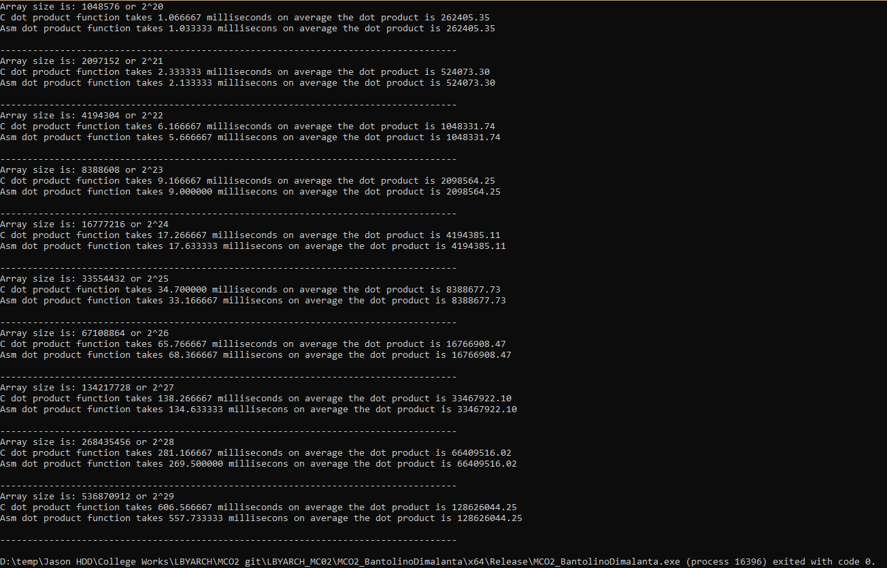

# [LBYARCH] MC02

This repository contains requirements for our LBYARCH MC02

## Requirements
Write the kernel in (1) C program and (2) an x86-64 assembly language.  The kernel is to perform a dot product between vector *A* and vector *B* and place the result in *sdot*.

## Analysis
The following presents the average execution times for both the C and x86-64 programs across various vector sizes, ranging from 2^20 to 2^30 with an incremental exponent of 1.

### Debug
In our initial debug mode attempt, we aimed to execute until an exponent of 30. However, upon reaching a vector size of 2^30, our system encountered a freeze, rendering the program unresponsive. Successful program execution was achieved when limiting the exponent to 29.

Below are the runtime results for debug mode:

The ASM program exhibited around 30% faster execution compared to the C program.

### Release
In release mode, similar to debug mode, we pursued execution until an exponent of 30. Again, similar to debug mode, the release mode operated smoothly up to a vector size of 2^29.

Below are the runtime results for release mode:

Despite still outperforming the C program, the ASM program's execution in release mode showed a decrease in speed compared to debug mode, resulting in a narrower performance margin between the two programs. Interestingly, the C program demonstrated improved performance compared to its debug mode statistics.

## Conclusion
The analysis above reveals how the ASM program consistently outperformed its C counterpart. Additionally, the ASM program ran faster in debug mode compared to its release mode couterpart, whilst the C program ran atleast 50% slower in debug mode compared to its release mode counterpart. This can be due to factors such as 

- ASM is a low level programming language, hence this allows programmers to manually allocate resources, resulting in highly optimized code
- C is a high level programming language, wherein compilers are in charge of allocating resources. 
- Debug mode prioritizes correct functionality over performance, hence benefitting the ASM code as programmers can right straightforward, efficient code without the hassle of compiler optimizations. 
- The C program fared badly in debug mode as overhead, such as debug information, can impact run time. On the other hand, it ran faster in release mode due to compiler optimizations present in this mode.